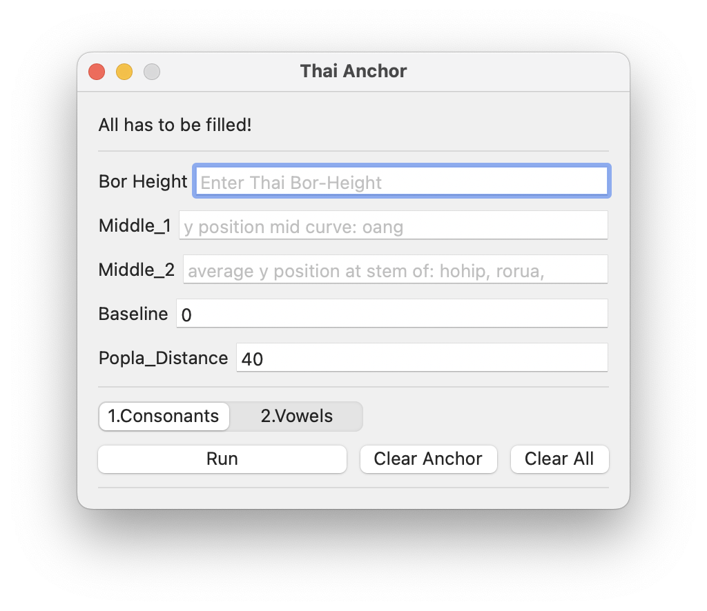

# Thai Anchor Consonants and Vowels script

This script is designed to help set up the position of anchors for Thai consonants and vowels in a font using the Robofont app.

## The script primarily functions to:

- Calculate the x and y coordinates for the placement of the 'top', '_top', 'bottom' and '_bottom' anchors in each glyph.
- Together with creating the guideline for the user based on the "y" coordinate input : bor-height, middle_1, middle_2 and baseline
- Offer functionality to clear existing anchors or guidelines.
- Offer functionality to calculate new anchor positions based on user-defined parameters.

## How to Use

1. Open RoboFont app.
2. Open the font you wish to manipulate.
3. Run this script. 

- You can input the following parameters: Bor Height, Middle_1, Middle_2, Baseline, and Popla_Distance.
- You can select between 1.Consonants and 2.Vowels  <!--two space to make the line break -->
**Noted that Vowels will work only in steps, first run 1.Consonants and then run 2.Vowels. If you change any of the value re-run them in step.**
- Click on the **"Run"** button to apply the anchor modifications
- If you need to clear all the anchor points in all glyphs, click on "Clear Anchor"
- If you want to clear all the anchor points and all guidelines and value, click on "Clear All". This will also clear all the input fields, except "convow", "baseline", and "distance"

## Requirements

This script requires the ezui, fontPens, and fontParts.world Python libraries, as well as RoboFont app. Before using this script, you would rather change **Thai glyphs name** to align with the script.

Robofont: change the name from [rbf_glyph-rename_glyphbrowser-to-th.py](rbf_glyph-rename_glyphbrowser-to-th.py)
*Feel free to change it according to your source.*

## Note

The script is specifically designed for Thai characters and may not function properly with other types of characters. Ensure your font has the necessary glyphs (such as "th-bobaimai", "th-popla", "th-saraii", etc.) before running the script.
